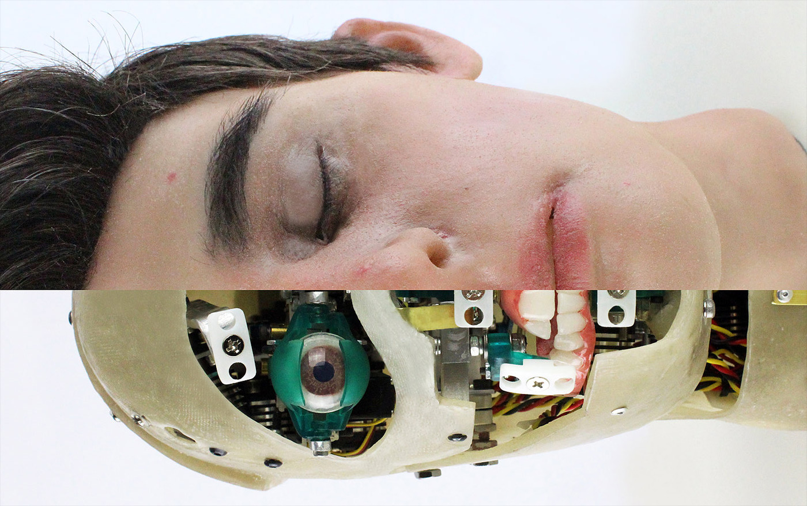

# Animatronic Head by MOD.

What does it mean to be human? How do you be a machine?

Josh is an animatronic head built for an exhibit at MOD. from May - October 2018. MOD. collaborated with [Marshall Tearle](https://www.marshalltearle.com) and [Sandpit](http://www.wearesandpit.com) to build the physical head and write the software to control the 15 servos.

Read more: [mod.org.au/josh](https://mod.org.au/exhibits/josh/) or [see Josh at MOD.](https://mod.org.au/visit/getting-here/)

## Software

This repository has all of the control software for Josh written in Python by [SyntheticDave](https://github.com/SyntheticDave) from Sandpit.

The most recent work has been done on the [Develop branch](https://github.com/MODatUniSA/mod-animatronic-head/tree/develop). So have a look around that branch too. If you’ve cloned this repo, switch over with: `git checkout develop`

## Running the Code

The code exists in `/home/josh/code/almost_human`, and is managed via a systemd service in `/libs/systemd/system/almost-human.service`. Managing this service requires root access, which you can gain by typing `su` into the terminal and entering the root password provided above.

* Start/Restart: `systemctl restart almost-human`
* Stop: `systermctl stop almost-human`
* Disable autostart on boot: `systemctl disable almost-human`
* Enable autostart on: `systermctl enable almost-human`

## Configuration

The code configuration is stored in `/home/josh/code/almost_human/.default_config.ini` and `/home/josh/code/almost_human/.device_config.ini` (note the leading period on the file names).

`.default_config` is checked into the repository, and provides reasonable default values for the code. It also contains comments to provide details on many of the settings. As this file is updated in the repository, device specific changes should not be made in this file, as changes to this file in the source control will require this file to be reset before those changes can be pulled. Note that sensitive information, such as access tokens should never be stored in this file.
 
`.device_config` contains the device specific settings, and is ignored in the repository. Device specific settings (anything that differs from the default config in the repository) and sensitive information should be stored in this file. Any settings in the default config are overwritten by settings present in this file.
 
The code should be restarted following any change to the config files for these changes to be applied.

## Data format for controlling Josh

All servo instructions used to control Josh are in CSV format and are stored under resources/instructions. There are 3 types on instructions Josh responds to. These are Position, Phoneme, and Parallel Sequence instructions.

The basic format of all instruction CSVs is as follows:

* Time - When to execute each individual instruction in the CSV
* Instruction Type - The type of instruction to execute
* Argument 1 - Required, and depends on the instruction type
* Argument 2 - Optional, only relevant for some instruction types

For a complete set of instructions, [get in touch with MOD.](https://mod.org.au/contact/)

## Service Status/Logs

You can check the status of the code using: `systemctl status almost-human`.

This will give whether the code is running, stopped, crashed, etc, and will show the most recent error on a crash.

The service attempts to restart the code every 5 seconds while the service is running. This means the code will restart itself on crashing. Errors that stop the code booting properly (e.g. not connected to the service control board), will result in a loop of the code starting, crashing, then restarting.

You can tail the service logs with: `journalctl -u almost-human –follow`.

This is useful for finding errors that are stopping the code from starting properly.

Code logs are located at `/home/josh/code/almost_human/logs`. Logs are split up into error, info, and verbose.

Log files are rotated at 10MB, and the most recent 5 log files of each type are retained.

You can watch these logs as they are written with tail
E.g. to tail the verbose log: `tail -f /home/josh/code/almost_human/logs/application_verbose.log`.

Note that it is possible for a log to be rotated while being tailed, so the tail will stop showing output. If this happens, just stop and restart the tail.

## Joystick control and more

For more control options including using an Xbox controller to control Josh’s facial movements, [get in touch with MOD.](https://mod.org.au/contact/)

## Credits

Animatronic build & silicone: [Marshall Tearle](https://www.marshalltearle.com)

Software & servo controller: [Sandpit](http://www.wearesandpit.com)

Project management: [MOD.](https://mod.org.au) ([Simon Loffler](https://github.com/sighmon))

## License

Released under an [MIT License](LICENSE).

Copyright (c) 2018 [MOD.](https://mod.org.au)
